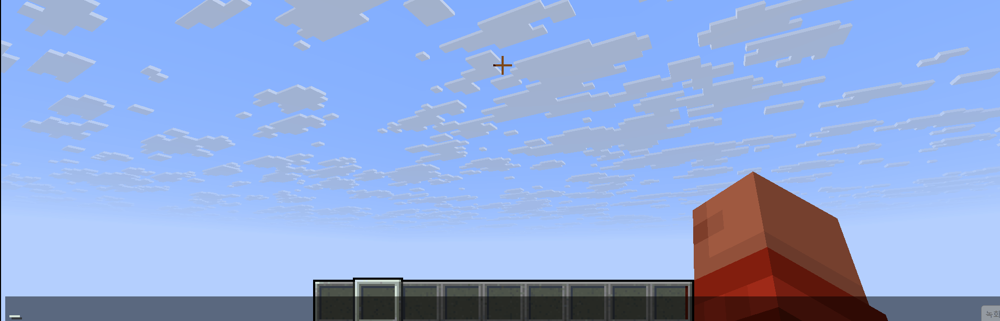

# Application

## Admin Mention

```
{
  "pattern": "@admin()",

  "title": "%player:displayname% mentioned you",
  "sound": {
    "id": "minecraft:entity.experience_orb.pickup",
    "category": "UI",
    "volume": 1.0,
    "pitch": 1.75
  },

  "cooldown": 0,
  "onlyTarget": false,

  "mentions": [
    {
      "mentionType": "LUCK_PERMS_GROUP",
      "preset": "admin"
    }
  ],
  "styles": [
    {
      "styleType": "BOLD",
      "preset": ""
    },
    {
      "styleType": "COLOR_GRADIENT",
      "preset": "#FF5555#C77DFF"
    },
    {
      "styleType": "CLICK_COMMAND_RUN",
      "preset": "execute in %world:id% run tp %player:pos_x% %player:pos_y% %player:pos_z%"
    },
    {
      "styleType": "DISCORD_JSON",
      "preset": "your webhook;{\"embeds\":[{\"title\":\"%player:name_unformatted% mentioned admins\",\"color\":16753920,\"description\":\"TP command\\n```mcfunction\\nexecute in %world:id% run tp %player:pos_x% %player:pos_y% %player:pos_z%\\n```\",\"fields\":[{\"name\":\"Content\",\"value\":\"%embellish-chat:content%\",\"inline\":false},{\"name\":\"UUID\",\"value\":\"`%player:uuid%`\",\"inline\":false},{\"name\":\"Player\",\"value\":\"`%player:name_unformatted%`\",\"inline\":true},{\"name\":\"Ping\",\"value\":\"`%player:ping% ms`\",\"inline\":true},{\"name\":\"\\u200b\",\"value\":\"\\u200b\",\"inline\":true},{\"name\":\"Position\",\"value\":\"`%player:pos_x% %player:pos_y% %player:pos_z%`\",\"inline\":true},{\"name\":\"World\",\"value\":\"`%world:id%`\",\"inline\":true},{\"name\":\"\\u200b\",\"value\":\"\\u200b\",\"inline\":true},{\"name\":\"Server\",\"value\":\"`%server:name%`\",\"inline\":true},{\"name\":\"Time\",\"value\":\"`%server:time%`\",\"inline\":true},{\"name\":\"Status\",\"value\":\"`TPS:%server:tps%` `MSPT:%server:mspt%`\",\"inline\":true}]}]}"
    }
  ]
}

```



You can place any valid option value directly in `preset`.
With this rule, typing `@admin` always notifies the `admin` group.
The `CLICK_COMMAND_RUN` style lets the notified administrator teleport to the sender's location.
If you also use `DISCORD_JSON`, the same mention can send a Discord notification.

## Making an announcement

```
{
  "pattern": "\\[notification\\]()",

  "title": "%player:displayname% mentioned you",
  "sound": {
    "id": "minecraft:entity.experience_orb.pickup",
    "category": "UI",
    "volume": 1.0,
    "pitch": 1.75
  },

  "cooldown": 0,
  "onlyTarget": false,

  "mentions": [
    {
      "mentionType": "EVERYONE",
      "preset": ""
    }
  ],
  "styles": [
    {
      "styleType": "BOLD",
      "preset": ""
    },
    {
      "styleType": "COLOR_HEX",
      "preset": "#FFAAAA"
    }
  ]
}

```

Typing `[notification]` sends an alert to everyone.

## Use as a channel

```
{
  "pattern": "#staff()",

  "title": "",
  "sound": null,

  "cooldown": 0,
  "onlyTarget": true,

  "mentions": [
    {
      "mentionType": "LUCK_PERMS_GROUP",
      "preset": "staff"
    }
  ],
  "styles": [
    {
      "styleType": "BOLD",
      "preset": ""
    },
    {
      "styleType": "COLOR_GRADIENT",
      "preset": "#FF5555#C77DFF"
    }
  ]
}

```

Setting `"onlyTarget": true` turns the mention rule into a private chat channel.
In this example, messages starting with `#staff` are not broadcast to global chat.
Instead, they are delivered only to players in the `staff` LuckPerms group.
