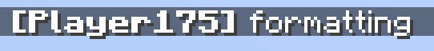
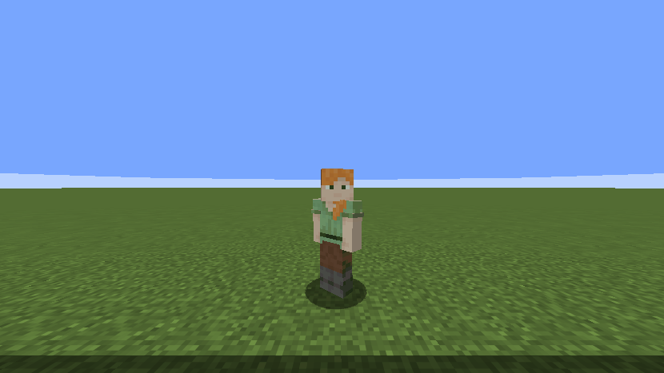
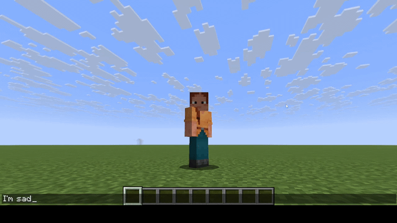
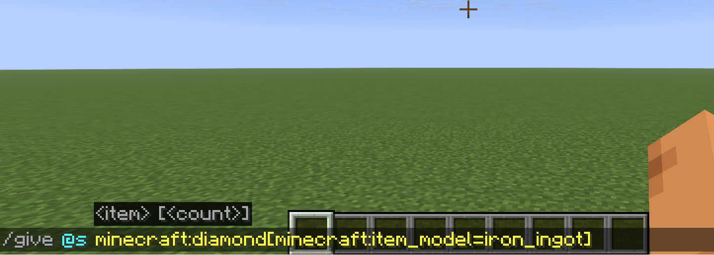

# Style Recipes

This page collects practical style recipes. Use them as starting points, then adjust permission groups, patterns, and
presets for your server.

## Chat Prefix

Goal: Add a formatted prefix before chat messages.

Edit `config/embellish-chat/presets.json`.

```json
{
  "prefix": {
    "chat.prefix.default": "<b>[%player:displayname%]</b> "
  }
}
```



!!! note "This belongs in presets.json"
    Prefix values are shared presets, not style rules. When you fully replace vanilla chat formatting, enable
    `disable_vanilla_chat_format` in `config.json`.

## Bubble Chat

Goal: Show messages above the player's head instead of sending normal chat.

```json
{
  "pattern": "(.+)()",
  "styles": [
    {
      "styleType": "BUBBLE",
      "preset": ""
    },
    {
      "styleType": "BLOCK",
      "preset": ""
    }
  ]
}
```



`BUBBLE` creates the speech bubble. `BLOCK` prevents the original message from also appearing in normal chat.

## Chat Macro

Goal: Run fixed commands when selected chat words appear.

```json
[
  {
    "pattern": "(sad)()",
    "styles": [
      {
        "styleType": "COMMAND_RUN",
        "preset": "/trigger ec.flag set 100"
      }
    ]
  },
  {
    "pattern": "(like|love)()",
    "styles": [
      {
        "styleType": "COMMAND_RUN",
        "preset": "/trigger ec.flag set 200"
      }
    ]
  }
]
```



## Global Style

Goal: Apply one effect to every chat message.

```json
{
  "pattern": "(.+)()",
  "styles": [
    {
      "styleType": "COLOR_RAINBOW",
      "preset": "0.3"
    }
  ]
}
```

Rule order matters when a full-message pattern can match the same text as other style rules.

## Direct Option

Goal: Use the matched word as both the displayed text and the style option.

```json
{
  "pattern": "((red))",
  "styles": [
    {
      "styleType": "COLOR_PRESET",
      "preset": ""
    }
  ]
}
```

Both capture groups contain `red`, so `COLOR_PRESET` receives `red` as the option and colors the matched word with the
`red` preset.

## Item Showcase

Goal: Let players share a view-only showcase of the item they are holding.

```json
{
  "pattern": "\\[i]()",
  "styles": [
    {
      "styleType": "SHOW_ITEM",
      "preset": ""
    }
  ]
}
```



Clicking the rendered showcase opens an inventory-style screen with the item placed in the center. Other players can
inspect it, but they cannot take it.

!!! note "Modded item sprites"
    Item showcase rendering uses inferred sprite information instead of reading every item's full client resource model.
    Vanilla items are expected to work well, but some modded items may render incorrectly. Use `presets.json` item
    overrides when a specific item needs a fixed atlas sprite.